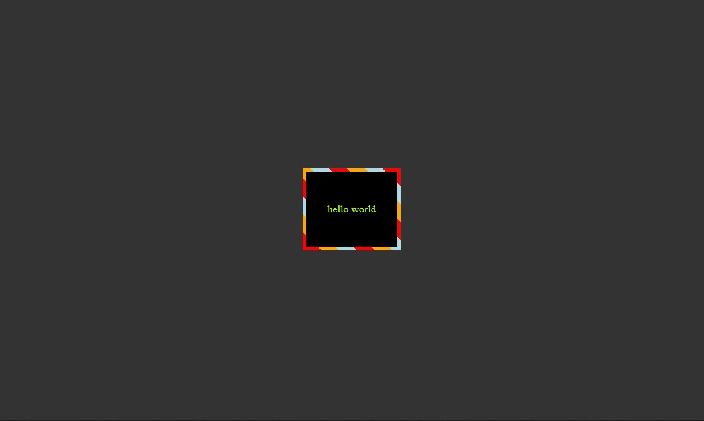

<div align="center">
  

  <h1>Bordex</h1>

  A simple React component library for addding styled borders to your elements.
</div>

> [!NOTE]
> This was originally a JavaScript library but has now been transformed into a simple React 
> component library. If you are still using the old version, you can find it at [v0.2.0](https://github.com/zshaian/bordex/tree/v0.2.0) or browse all previous versions under the [Tags](https://github.com/zshaian/bordex/tags) section.
> The documentation for the previous JavaScript library is maintained separately. You can find it in the [Bordex Docs](https://bordex.netlify.app/) or [Bordex Archieve Repo Docs](https://github.com/zshaian/bordex-docs)

## Table of Contents

- [Installation](#installation)
- [Usage](#usage)
- [Documentation](#documentation)
- [Examples](#examples)
- [Contributing](#contributing)
- [License](#license)

## Installation

You can install Bordex via npm:

```bash
npm install bordex
```

## Usage

Here's a quick example of how to use Bordex in your project:

```tsx
import { GradientBorder } from 'bordex';

export default function App() {
  return (
    <GradientBorder
      angle="45deg"
      colors={['red', 'green', 'blue']}
      borderWidth="5px"
    >
      <p>Gradient Border</p>
    </GradientBorder>
  );
}
```
## Documentation
Check out the [Bordex Documentation](https://zshaian.github.io/bordex/) for a detailed list of available components and options.

## Examples
Let's see an example on how to add a **stripe border** to an element
```tsx
import { StripeBorder } from 'bordex';

export default function App(){
  return (
    <StripeBorder
    borderWidth='5px'
    stripeWidth='10'
    angle='45deg'
    colors={['red', 'orange', 'lightblue']}>
      <p>Stripe Border</p>
    </StripeBorder>
  )
}
```


Check out the [Documentation](https://zshaian.github.io/bordex/) for a more detailed list about the available styled borders.

## Contributing

Contributions are welcome! Please read the [CONTRIBUTING.md](./CONTRIBUTING.md ) for guidelines on how to conribute to this project.

1. Fork the Project
2. Create your Feature Branch (`git checkout -b feature/AmazingFeature`)
3. Commit your Changes (`git commit -m 'Add some AmazingFeature'`)
4. Push to the Branch (`git push origin feature/AmazingFeature`)
6. Open a Pull Request

## License

This project is licensed under the MIT License. See the [LICENSE](LICENSE) file for more details.
